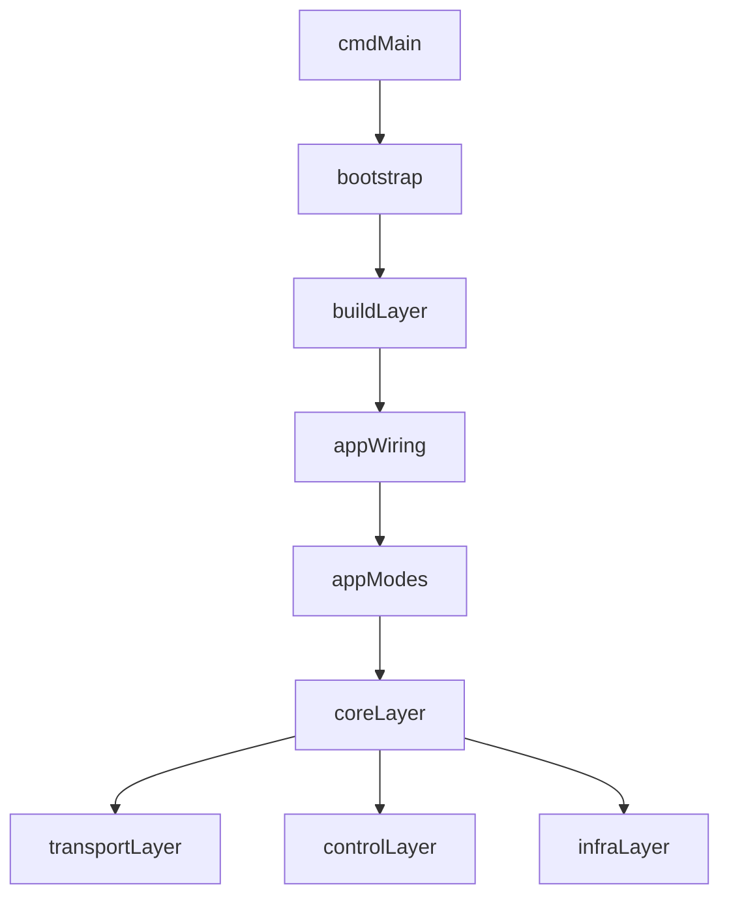

当前仓库已经完成一次较大规模的结构收口。现在的核心原则是：

- 仓库根目录只保留工作区级文件，例如 `README.md`、`docs/`、`example/`、`Makefile`、`Dockerfile`、CI 配置等
- 所有 Go 代码统一位于 `src/`，`src/go.mod` 是真正的模块根
- 运行时实现默认进入 `src/internal/...`
- 仅对外稳定暴露的能力进入 `src/pkg/...`
- 编译期功能选择使用 `src/build/...`

## 当前目录分层

```text
src/
  cmd/
    trojan-go/
  build/
  internal/
    app/
    control/
    core/
    infra/
    transport/
  pkg/
  common/
  constant/
  config/
  mobilebind/
```

各层职责如下：

- `cmd/`
  进程入口。`cmd/trojan-go/main.go` 只负责调用 bootstrap，不直接承载业务逻辑。

- `build/`
  编译期装配层。这里通过 build tags 和空导入来决定启用哪些运行模式与可选功能。

- `internal/app/`
  应用层。负责启动流程、运行模式、选项注册和可执行特性。

- `internal/control/`
  控制面。包括 gRPC 服务和 CLI 控制入口。

- `internal/core/`
  核心抽象与编排。这里放协议抽象、代理编排、配置注册、鉴权接口、转发原语等。

- `internal/infra/`
  基础设施实现。包括日志、统计、地理数据库等底层实现。

- `internal/transport/`
  具体协议实现，按角色拆分为入站、出站和可叠加传输层。

- `pkg/`
  对外稳定导出的公共能力。目前主要是 `pkg/sharelink` 和 `pkg/version`。

- `common/`
  通用但相对纯粹的基础工具函数，仍作为共享底层保留。

- `config/`
  兼容入口。当前仍保留旧导入路径，但真实实现已转到 `internal/core/config`。

- `mobilebind/`
  移动端对外入口，保留顶层路径以维持外部调用兼容性。

## 启动与依赖方向

当前推荐从下面的路径理解程序启动过程：



可以把它理解成：

1. `cmd` 进入 `bootstrap`
2. `bootstrap` 触发 `build` 装配
3. `build` 导入 `internal/app/wiring/...`
4. `wiring` 注册运行模式、控制面和可选特性
5. 运行模式调用 `internal/core` 的代理编排能力
6. `core` 再依赖 `transport`、`infra`、`control` 中的具体实现

## transport 的拆分方式

以前所有协议都放在统一的 `tunnel/` 目录下，现在已经按运行角色拆成三类：

- `internal/transport/inbound/`
  监听侧协议，例如 `adapter`、`dokodemo`、`http`、`socks`、`tproxy`

- `internal/transport/outbound/`
  出站侧协议，例如 `freedom`、`shadowsocks`、`simplesocks`、`trojan`

- `internal/transport/layer/`
  可叠加承载层，例如 `tls`、`websocket`、`mux`、`router`、`transport`

这样做之后，阅读代码时可以更快判断一个包在协议栈里的角色，而不是先读实现再反推它属于入站、出站还是中间层。

## core 的职责边界

`internal/core/` 现在主要负责“规则”和“编排”，而不是具体协议本身：

- `core/tunnel`
  协议抽象、元数据和统一接口

- `core/proxy`
  入站树和出站链的组装、代理运行时核心

- `core/auth`
  用户认证与统计相关抽象

- `core/config`
  配置注册和配置注入

- `core/relay`
  通用双向转发能力与相关原语

这层的目标是保持稳定，让上层启动逻辑和下层协议实现都围绕这组抽象协作。

## app 层的职责边界

`internal/app/` 解决的是“程序怎么跑起来”，而不是“协议如何收发数据”。

当前大致分成三块：

- `app/bootstrap`
  统一启动入口

- `app/runtime/options`
  全局命令选项注册与调度

- `app/mode/*`
  运行模式，例如 client、server、forward、nat、custom

- `app/features/*`
  CLI 级附加功能，例如 easy、URL 模式、version

## 哪些包是兼容层

当前仍保留少量兼容路径，主要用于降低一次性迁移的破坏面：

- `config/`
  继续可被旧代码导入，但内部只是转发到 `internal/core/config`

- `mobilebind/`
  继续保留顶层公共路径

- `main.go`
  仍保留在 `src/` 下作为兼容入口，但推荐使用 `cmd/trojan-go/main.go` 理解实际入口

## 阅读代码的建议顺序

如果你第一次进入这个仓库，推荐按下面顺序阅读：

1. `src/cmd/trojan-go/main.go`
2. `src/internal/app/bootstrap`
3. `src/build`
4. `src/internal/app/wiring`
5. `src/internal/app/mode`
6. `src/internal/core/proxy`
7. `src/internal/core/tunnel`
8. `src/internal/transport`

这样能先建立“程序如何启动”的整体心智，再去看具体协议实现。
