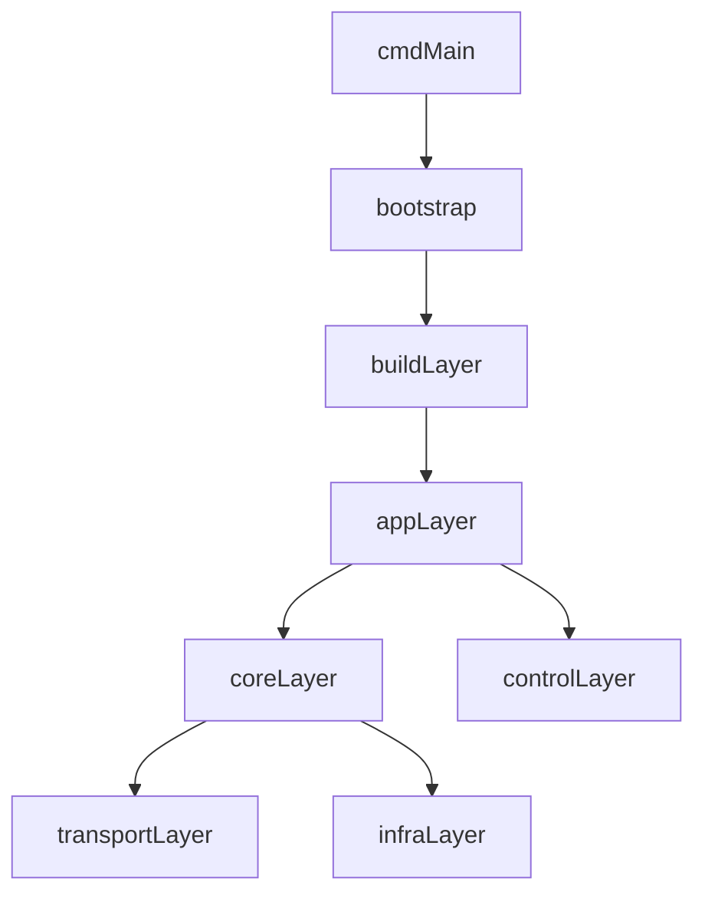

# Project Structure

仓库已经切换为 `src/` 作为 Go 模块根目录，仓库根只保留工作区级资源。

## 总体布局

```text
repo/
  README.md
  Makefile
  Dockerfile
  go.work
  docs/
  example/
  src/
    go.mod
    cmd/
    build/
    internal/
    pkg/
    common/
    constant/
    config/
    mobilebind/
```

可以把它理解成两层：

- 仓库根：
  文档、示例、CI、Docker、发布脚本、工作区级配置

- `src/`：
  真正的 Go 模块和全部源码

## 代码分层

### `src/cmd`

进程入口层。当前主入口是 `cmd/trojan-go/main.go`，职责非常单一，只负责把控制权交给 bootstrap。

### `src/build`

编译期装配层。这里不承载业务逻辑，而是通过 build tags 和空导入来决定：

- 启用哪些运行模式
- 是否启用 API、MySQL、other feature 等附加能力

### `src/internal/app`

应用层，解决“程序如何启动和运行”的问题。

- `bootstrap`
  统一启动入口
- `runtime/options`
  命令选项注册与调度
- `mode`
  client、server、forward、nat、custom 等运行模式
- `features`
  easy、URL 模式、version 等 CLI 特性
- `wiring`
  按功能分组的注册入口

### `src/internal/core`

核心抽象与编排层，解决“程序如何组织能力”的问题。

- `tunnel`
  协议抽象、元数据、统一接口
- `proxy`
  入站树、出站链、代理运行时编排
- `auth`
  用户认证和统计抽象
- `config`
  配置注册、配置解析与注入
- `relay`
  通用转发原语

### `src/internal/control`

控制面：

- `grpc`
  gRPC API 服务与 protobuf 代码
- `cli`
  面向命令行的控制入口
- `api`
  控制面注册抽象

### `src/internal/infra`

基础设施实现：

- `log`
- `stats`
- `geodata`

这层负责具体实现，不负责定义核心抽象。

### `src/internal/transport`

协议实现层，按角色拆分：

- `inbound`
  入站监听协议
- `outbound`
  出站拨号协议
- `layer`
  可叠加传输层

### `src/pkg`

稳定公共导出层。只有适合对外复用、并且不应携带启动副作用的能力，才应该放在这里。

当前主要包括：

- `pkg/sharelink`
- `pkg/version`

## 依赖方向



推荐遵守这些规则：

- `cmd` 不直接编排业务，只负责启动
- `build` 只负责启用功能，不承载业务实现
- `app` 负责“怎么跑起来”
- `core` 负责“怎么组织能力”
- `transport` / `infra` 负责“具体怎么实现”
- `pkg` 只放稳定、无副作用、可复用的公共 API

## 当前保留的兼容入口

为了避免一次性重构破坏太大，目前仍保留少量顶层兼容入口：

- `src/config`
  旧配置导入路径，内部转发到 `internal/core/config`
- `src/mobilebind`
  保留对外公共调用路径
- `src/main.go`
  兼容入口，内部转发到 bootstrap

## 阅读建议

如果你想理解现在的结构，推荐按下面顺序阅读：

1. `src/cmd/trojan-go/main.go`
2. `src/internal/app/bootstrap`
3. `src/build`
4. `src/internal/app/wiring`
5. `src/internal/app/mode`
6. `src/internal/core/proxy`
7. `src/internal/core/tunnel`
8. `src/internal/transport`
